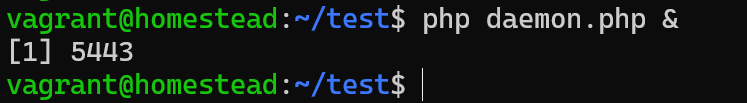

#### 任务(job)管理
有时候我们需要一个脚本长时间的在后台执行不终止掉，我们正常会加个 & 让程序在后台跑，比如下面这段代码:
```php
<?php
while (true) {
    sleep(1);
}
``` 

  
上面代码保存成daemon.php，然后用 php daemon.php & 就能放到后台工作，返回结果如上图。其中的[1]表示后台任务的序号，5443就是其进程ID，其实这就是任务管理。  

举个栗子，我们在登陆bash后， 想要一边复制文件、一边进行数据搜寻、一边进行编译，这个怎么实现。那就是像上面的一样，把任务放到后台运行，这样就不影响在终端干别的事情。

所以顾名思义，任务管理就是指在Bash中对同一个tty中的多个工作进行添加、删除、处理等。由于Bash中的每个job实际上是当前Bash的子进程，
因此，从根本上说，任务管理就是对进程的管理。注意“同一个tty”这一字眼，因为我们是无法通过tty1的任务管理去管理tty2中的job。
1. 加“ & ” 代表将指令丢到背景(background)中执行
2. 通过 fg {job_id} 将放到前景中运行
3. 通过 bg {job_id} 恢复后台任务运行
4. 通过 jobs 列出背景任务列表

假设我们正在使用vim ，发现有个文件不知道放在哪里，需要到 bash 环境下进行寻找，此时不需要退出vim，只要在vim的一般模式下，按下 [ctrl] 及 z 将他丢到背景中即可。然后通过fg {job_id}就可以继续编辑了。

但是任务管理中的“背景”是 bash 的背景，并不是系统的背景！任务管理的背景依旧与终端机有关，如果我们吧任务放到背景中执行，这时关掉终端的话，背景的任务也是会被中断掉。

#### nohup命令
既然任务放到背景中执行也是bash相关的，那需要进行长时间执行的任务咋办尼，于是就有了nohup命令。
让我来说道说道，其实当我们关闭一个终端窗口时，会给进程发送一个叫SIGHUP的信号，一些进程在收到SIGHUP信号后就会终止退出，
而nohup命令的意思就是no hang up，就是不挂断，就是忽略SIGHUP信号的意思，nohup之后与终端机无关， 所以标准输出就会被导向“ ~/nohup.out ”。
然后我又发现nohup php daemon.php &之后，再次创建一个php daemon.php &的任务2，任务2同样也会脱离bash的。

#### 守护进程
上文中说的似乎加了nohup之后就完美了，但是事实并非如此，笔者就曾经遇到过，nohup之后，过了一段时间，进程还是莫名其妙没了，所以无论是末尾加上&符号亦或是头部加上nohup，都不是最靠谱的方案。
所以需要一种正规而又稳定化的进程后台方法。那就是守护进程了。

创建守护进程之前，我们要先了解一些基本概念：
- 进程组 ： 一组相关的进程会组成一个进程组，每个进程都属于一个进程组，每个进程组有一个组长，进程组都有一个进程组号，该号等于该进程组组长的PID，一个进程只能为它自己或子进程设置进程组ID号。
- 会话组：会话组(session)是一个或多个进程组的集合。每个会话组有一个组长，每个会话组都有一个会话首进程
  - 使用setsid()函数可以建立一个新的会话组,此进程变成该会话组的首进程
  - 组长进程无法调用setsid()，会报错
  - 非组长进程可调用setsid创建出一个新的会话组，这个行为会导致[ 该进程会创建一个新的进程组且自身为该进程组组长，该进程会创建出一个新的会话组且自身为该会话组组长，该进程会脱离当前命令行控制终端 ]

编写守护进程的一般步骤：
1. 在父进程中执行fork并exit退出；
> 为避免挂起控制终端，将Daemon放入后台执行。方法是在进程中调用fork使父进程终止，让Daemon在子进程中后台执行。
2. 在子进程中调用setsid函数创建新的会话；
> 一个会话组共享一个控制终端。这个控制终端通常是创建进程的登录终端，登录会话和进程组通常是从父进程继承下来的。我们的目的就是要摆脱它们，使之不受它们的影响。
> 调用setsid()使进程成为新的会话组长和新的进程组长，并与原来的登录会话和进程组脱离。由于会话过程对控制终端的独占性，进程同时与控制终端脱离。
3. 在子进程中调用chdir函数，让根目录 ”/” 成为子进程的工作目录；
> 进程活动时，其工作目录所在的文件系统不能卸下。一般需要将工作目录改变到根目录。对于需要转储核心，写运行日志的进程将工作目录改变到特定目录如/tmpchdir("/") 
4. 在子进程中调用umask函数，设置进程的umask为0；
> 进程从创建它的父进程那里继承了文件创建掩码。它可能修改守护进程所创建的文件的存取位。为防止这一点，将文件创建掩模清除：umask(0);
5. 在子进程中关闭任何不需要的文件描述符
> 进程从创建它的父进程那里继承了打开的文件描述符。如不关闭，将会浪费系统资源，造成进程所在的文件系统无法卸下以及引起无法预料的错误。
```php
<?php
function daemonize()
{
// 设置权限掩码
    umask(0);
// 将目录更换到指定某个目录，一般是根目录
    chdir('/');
    $pid = pcntl_fork();
    if (0 == $pid) {
// setsid创建新会话组
        if (posix_setsid() < 0) {
            exit();
        }
// 在子进程中二次fork()，避免SVR4种一次fork有时候无法脱离控制终端
        $pid = pcntl_fork();
        if ($pid > 0) {
            exit;
        }
// 关闭 标准输入
        fclose(STDOUT);
    } elseif ($pid > 0) {
        exit();
    }
}

daemonize();
while (1) {
    sleep(1);
}

```